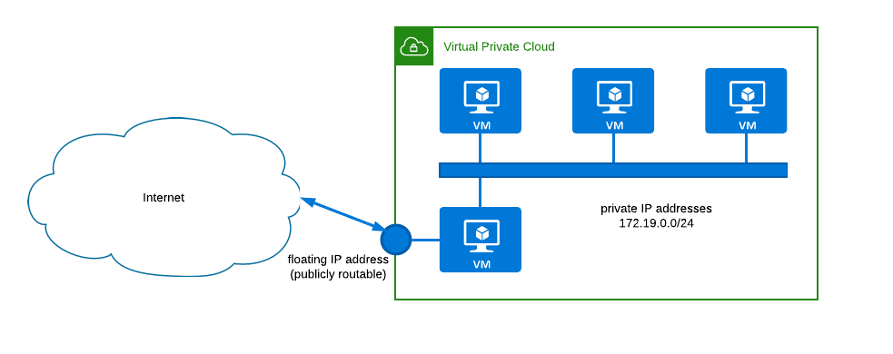

# VPC installer

This is a command that installs and configures a OpenVPN server with the aim of being the entry point for a private and isolated network. The basic setup is shown in the next figure:



This script will install a OpenVPN server in the front-end, and will prepare the `iptables` rules to be able for the clients to get to the nodes in the internal network. So that the client keep their network setup and only the traffic directed to the private network is routed through the VPN.

## Installation

At this time, it is only available for apt-based distributions like Ubuntu.

### Dependencies

The script relies on some dependencies such as `jq`, `curl`, `wget` and `bash`, that are usually installed in most of Linux boxes. If not, please install them.

- `jq`, `curl`, `wget` are needed to install EasyRSA.
- `bash` is needed for the whole script.
- `iptables` is needed for NAT from the VPN network to the internal network (openvpn will also install it).

#### Ubuntu

```
$ apt update
$ apt install wget curl jq iptables --no-install-recommends
```

### Installing

There is no installation procedure... just clone the repo (I prefer this method)

```
$ git clone https://github.com/grycap/vpc
```

or get the `vpc.sh` file from [here](https://raw.githubusercontent.com/grycap/vpc/master/vpc.sh).

And you are ready to use it.

## Using the script to create your VPC

In first place, you need to install [EasyRSA](https://github.com/OpenVPN/easy-rsa). The script will automatically download it and put it in folder `/opt/`. You just need to issue the next command:

```
$ ./vpc.sh easyrsa
```

Once EasyRSA is available at `/opt/easyrsa` folder, you can install and configure the OpenVPN server. Have in mind that you need an interface connected to the internal network (e.g. 10.0.0.1, that is connected to network 10.0.0.0/24). Then you can use the next command:

```
$ ./vpc.sh server -i 10.0.0.1/24
(...)
Service file for systemd /etc/openvpn/openvpnserver/scripts/vpcnat_openvpnserver.service has been created

This file makes that masquerading is enabled from the VPN network to the private network once the OpenVPN server is started.

To automate this process, you can
- copy (or to move) the file to /etc/systemd/system/
- run systemctl daemon-reload
- run systemctl enable vpcnat_openvpnserver.service

When service openvpn@openvpnserver.service is started, the masquerading process will be triggered by running the script /etc/openvpn/openvpnserver/scripts/donat.sh
When the service is stopped, the script /etc/openvpn/openvpnserver/scripts/rmnat.sh will be triggered
```

> This command 
> 1. Installs OpenVPN
> 1. Generates the certificates for the server
> 1. Configures the OpenVPN server
> 1. Generates some files to enable and disable NAT from the VPN to the internal network
> 1. Generates a `.service` file to be used in `systemd` based linux boxes to enable NAT and start the OpenVPN server at once.

As the scripts suggest, you should copy the service file to the proper location and start the services:

```
$ cp /etc/openvpn/openvpnserver/scripts/vpcnat_openvpnserver.service /etc/systemd/system/
$ systemctl daemon-reload
$ systemctl start vpcnat_openvpnserver.service
# systemctl status vpcnat_openvpnserver.service
● vpcnat_openvpnserver.service - Nat rules to access the private network 10.0.0.0/24 from VPN 172.19.148.0/24
   Loaded: loaded (/etc/systemd/system/vpcnat_openvpnserver.service; enabled; vendor preset: enabled)
   Active: active (exited) since Wed 2020-06-17 15:14:05 UTC; 5s ago
  Process: 13333 ExecStart=/etc/openvpn/openvpnserver/scripts/donat.sh (code=exited, status=0/SUCCESS)
 Main PID: 13333 (code=exited, status=0/SUCCESS)

Jun 17 15:14:05 vpcfront systemd[1]: Starting Nat rules to access the private network 10.0.0.0/24 from VPN 172.19.148.0/24...
Jun 17 15:14:05 vpcfront donat.sh[13333]: net.ipv4.ip_forward = 1
Jun 17 15:14:05 vpcfront systemd[1]: Started Nat rules to access the private network 10.0.0.0/24 from VPN 172.19.148.0/24.
```

At this point you just need to enable one client to access to the VPC:

```
$ ./vpc.sh client new
$ ls -l
total 28
-rw------- 1 root   root    8226 Jun 17 15:14 a7d399659b333e931046e4959e635e32.ovpn
-rwxr-xr-x 1 root   root   14007 Jun 17 15:00 vpc.sh
```

Now you can copy file `a7d399659b333e931046e4959e635e32.ovpn` to your client computer and issue the next command (where 158.42.1.123 is the publicly routable IP address of the server in which we have just installed the OpenVPN server):

```
root@openvpnclient:~# openvpn --config a7d399659b333e931046e4959e635e32.ovpn --remote 158.42.1.123 --port 10443
Wed Jun 17 17:16:51 2020 OpenVPN 2.4.4 x86_64-pc-linux-gnu [SSL (OpenSSL)] [LZO] [LZ4] [EPOLL] [PKCS11] [MH/PKTINFO] [AEAD] built on May 14 2019
Wed Jun 17 17:16:51 2020 library versions: OpenSSL 1.1.1  11 Sep 2018, LZO 2.08
Wed Jun 17 17:16:51 2020 Outgoing Control Channel Authentication: Using 512 bit message hash 'SHA512' for HMAC authentication
Wed Jun 17 17:16:51 2020 Incoming Control Channel Authentication: Using 512 bit message hash 'SHA512' for HMAC authentication
(...)
```

And that's all.

Now you can verify that (in the client) you have a new interface (typically `tun0`) with an IP address in the VPN that we have just created, and the route to the internal network is through the VPN:

```
root@openvpnclient:~# ip a
(...)
7: tun0: <POINTOPOINT,MULTICAST,NOARP,UP,LOWER_UP> mtu 1500 qdisc fq_codel state UNKNOWN group default qlen 100
    link/none
    inet 172.19.148.6 peer 172.19.148.5/32 scope global tun0
       valid_lft forever preferred_lft forever
    inet6 fe80::d43a:bb50:50fa:34c0/64 scope link stable-privacy
       valid_lft forever preferred_lft forever
root@openvpnclient:~# ip route
default via 192.168.64.1 dev enp0s2 proto dhcp src 192.168.64.10 metric 100
10.0.0.0/24 via 172.19.148.5 dev tun0
172.19.148.1 via 172.19.148.5 dev tun0
172.19.148.5 dev tun0 proto kernel scope link src 172.19.148.6
192.168.64.0/24 dev enp0s2 proto kernel scope link src 192.168.64.10
192.168.64.1 dev enp0s2 proto dhcp scope link src 192.168.64.10 metric 100       
```

Finally you can (e.g) ssh to an internal host:

```
root@openvpnclient:~# ssh ubuntu@172.19.0.5
Welcome to Ubuntu 18.04.4 LTS (GNU/Linux 4.15.0-43-generic x86_64)

 * Documentation:  https://help.ubuntu.com
 * Management:     https://landscape.canonical.com
 * Support:        https://ubuntu.com/advantage

(...)
```

## Other things that this script can do

This script can do some more things. E.g. configure different OpenVPN servers with different names (and certificates), generate client configuration files for each of the servers, use specific names for the client certificates, install a simple OpenVPN server, etc. Please check the help:

```
$ ./vpc.sh help
```

### Generate more client credentials

You can generate more client credentials to enable other users to get to your VPC.

```
$ ./vpc.sh client new -f credentials_file.ovpn
```

The file `credentials_file.ovpn` will be ready to be used with the openvpn client.

### Install and configure an OpenVPN server

If you just want to install and configure a OpenVPN without access to any internal network, you can just issue the next command:

```
$ ./vpc.sh server --skip-nat
```

And a basic OpenVPN server will be automatically configured. Later you can generate more clients.